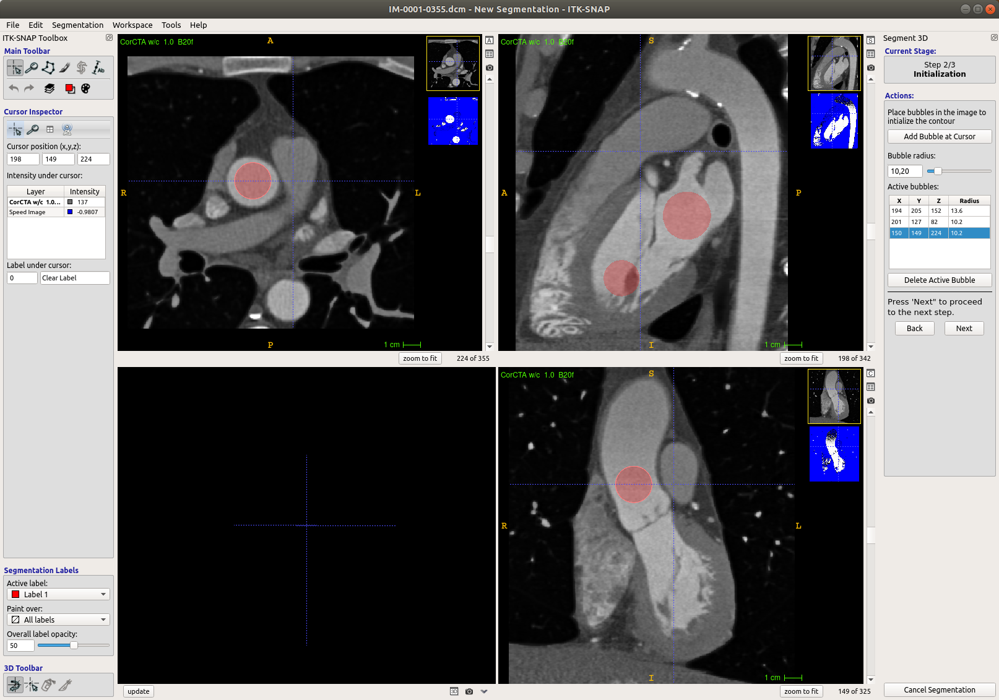
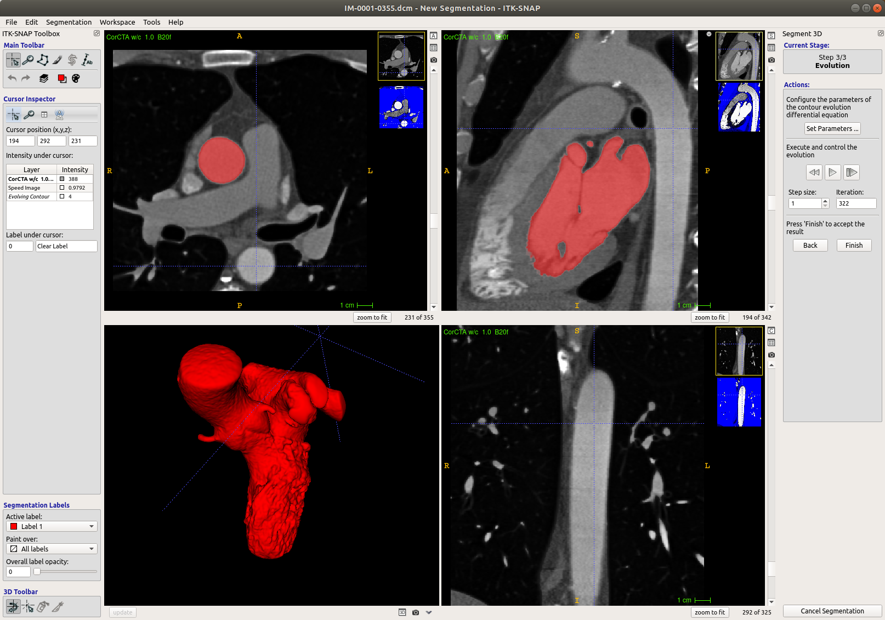
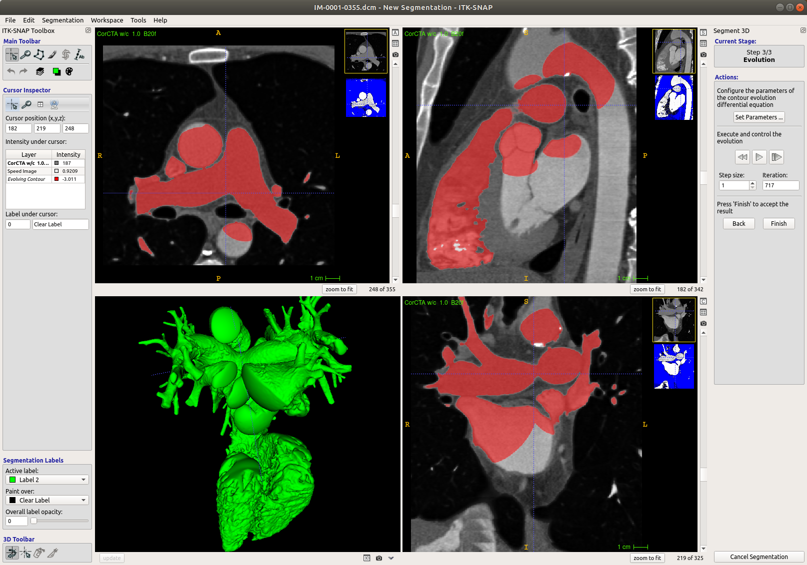
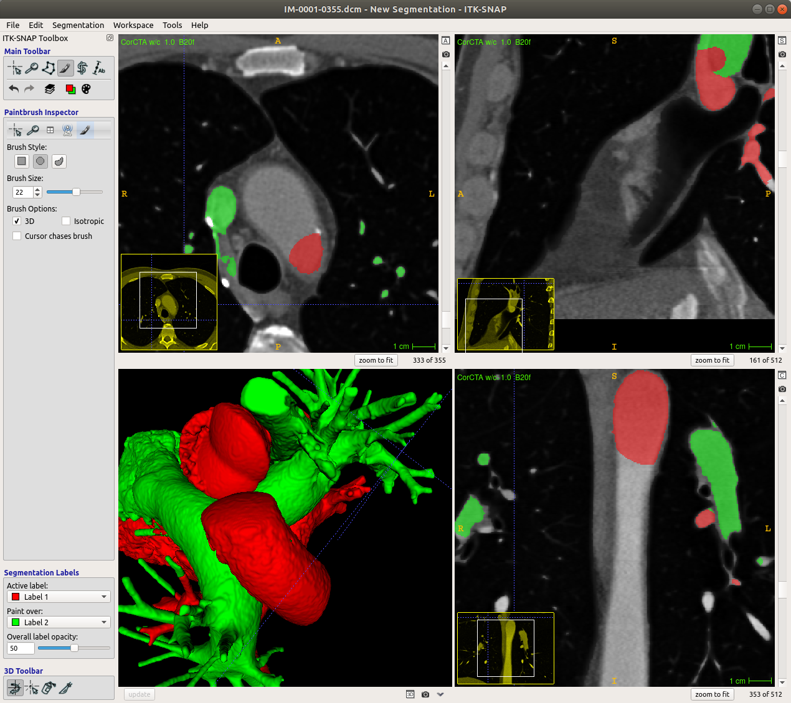
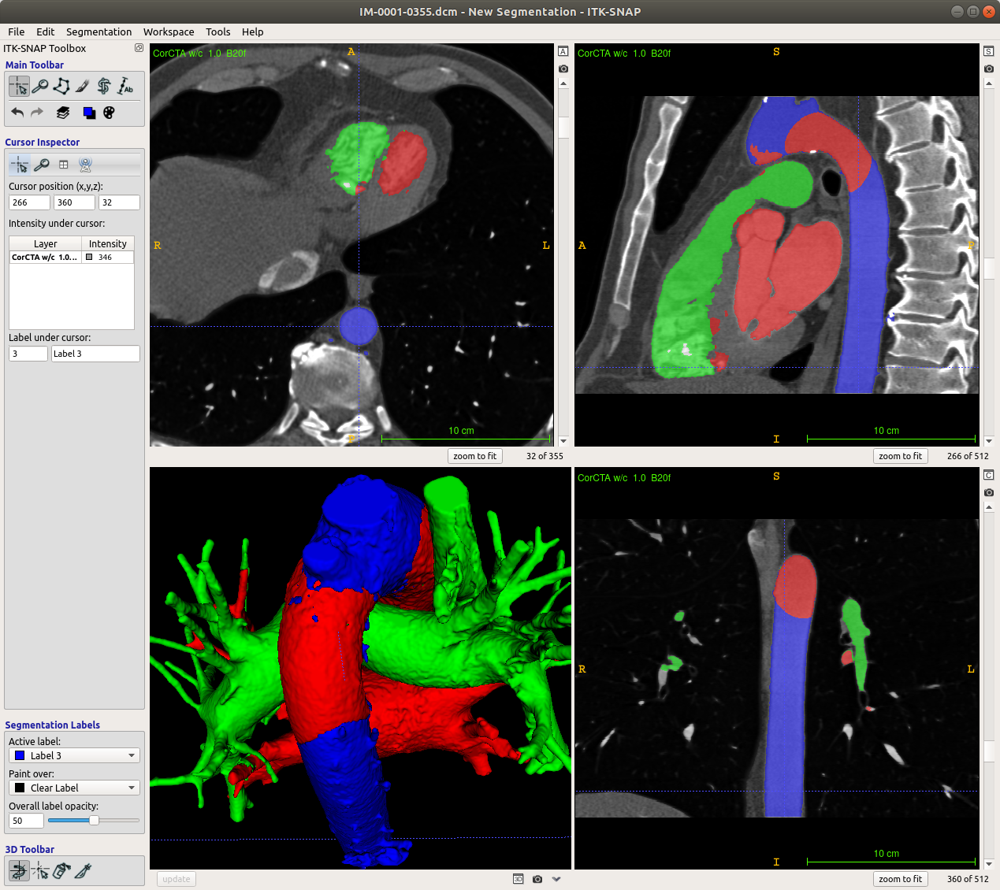
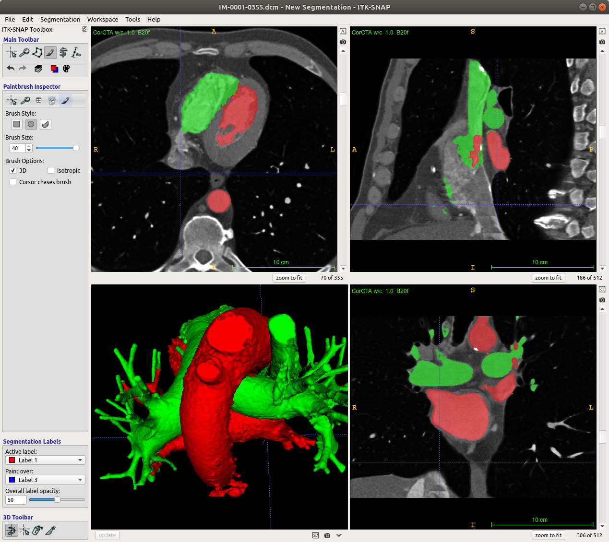

# ITK-SNAP: Semi-automatic image segmentation

#### by Alexandra K. Diem [@akdiem](https://github.com/akdiem)

ITK-SNAP is a fantastic tool for image segmentation that comes with very easy-to-use semi-automatic segmentation functionality. Let’s take a look at the user interface on start-up:

To open a stack of DICOM images click on “Open Image …” in the bottom right corner and select the first .dcm image in your image series and follow the dialogues to load it. In this tutorial I use a series of cardiac CT images from the Osirix Dicom Library (AGECANONIX, https://www.osirix-viewer.com/resources/dicom-image-library/).

After loading the images you are presented with the ITK-SNAP workbench.

The different image views are presented in the three panels at the top left, top right and bottom right, while the bottom left is reserved for the 3D view of your segmentation, so you can ignore it for now. In the panels you can zoom by clicking the right mouse button, move the cross-hair cursor position by clicking the left mouse button and move the image view by clicking the mouse wheel / middle mouse button.

Before beginning with the actual segmentation, we need to adjust the contrast. To auto-adjust hit CTRL-J (CTRL-SHIFT-J to undo). To adjust it manually go to "Tools" &rightarrow; "Image contrast" &rightarrow; "Contrast adjustment ...".

Here you can modify the curve over the histogram to suit your needs. In my case I modified the curve to increase the contrast of blood.

To begin the semi-automatic segmentation either click on the snake button in the Main Toolbar (Active Contour (aka "Snake") Segmentation Mode) or just hit "5" on your keyboard. It can be really difficult to see, but you can now modify the Region Of Interest (ROI) by adjusting the red/yellow dashed borders around your images.

Here I’ve set the ROI to include the heart, the aorta, and a large part of the pulmonary veins coming off the left atrium. Move on by clicking on "Segment 3D".

The first step in the semi-automatic segmentation process is thresholding. Adjust the sliders for the lower and upper threshold such that your area of interest appears as bright white as possible in the blue-and-white preview window.

Ideally, I would have liked to include all blood filled spaces in one go, but the shades of grey are fairly different for the left heart, right heart, and the aorta. So I chose the lower threshold 226 and upper threshold 518 and advance to the next step by clicking on "Next".

The second step is to initialise the automatic segmentation by placing a set of "bubbles" in areas that we'd like to segment.

Bubbles are placed by moving the crosshair cursor to the desired location and clicking on "Add Bubble at Cursor". The size of the bubble can be adjusted using the slider after placing the bubble. You can add as many bubbles as you like. My experience has shown that you get the best results if you place few bubbles that are as large as possible. Here I've placed a bubble in the left ventricle, left atrium, and ascending aorta each. Advance to the next step by clicking on "next".

The final step is the easiest, because you just have to hit the "Play" button, sit back, and wait for the automatic segmentation to do its job. By clicking on "Update" below the bottom left panel we can check the 3D view of the label.

After around 320 iterations we get a fairly complete segmentation of the cavities of the left ventricle and left atrium, as well as the lumina of the ascending aorta and pulmonary veins. Some short sections of the coronary arteries are also visible. Continuing the time evolution of the automatic segmentation extends the segmentation of these arteries and veins further. It is a good idea to keep checking the progress by updating the 3D view every 100 iterations or so since you have to start from the beginning if you decided that you went too far. Here I stopped at 800 iterations. Close the segmentation window by clicking on "Finish". 

")

The workbench panels now show the segmentation. To begin segmenting the right heart choose "Label 2" (green) under "Active label" at the bottom left, and "Clear label" under "Paint over". This setting ensures that the new segmentation does not leak into our segmentation of the left heart. Go back to the snake tool and click on "Segment 3D". The ROI is the same as before, so we don't need to change it. I set the thresholds for segmenting the right heart to 85--571, which includes the left heart. Therefore it is important that we selected to only let the new label paint over the clear label. In the next step I placed bubbles in the right ventricle, right atrium, and pulmonary arteries and started the automatic segmentation. Note that the automatic segmentation always appears in red regardless of the label colour chosen. 

This time it took around 720 iterations to complete the right heart. Note that the automatic segmentation will "leak" into the left heart because of the thresholds we chose earlier.

")

Since we specified that the green label shall only paint over the clear label our previous segmentation has remained untouched. However, we find green "borders" around large parts of the red segmentation. These we have to fix manually. Select the red label as the active label to only paint over the green label. Click on the paintbrush tool (or hit "4" on the keyboard), select a round brush with a fairly large size (22 here), and select "3D". Now you can paint over the green borders in the image panels without having to worry about affecting the clear label. It is a good idea to focus on one part of the heart at a time (for example, left ventricle first, then left atrium, then aorta). I recommend to update the 3D view often to double check.

Let's take a closer look at the aorta.

In the CT images the aorta is fully visible, but our segmentation so far only includes disconneted parts of the ascending and descending aorta. We would like to add the remaining parts of the aorta to the red label. We can't do this directly as it would overwrite our previous segmentation. Instead, we can pick a third label (blue) as the active label to paint over the clear label and perform another "snake" segmentation. We can use the same thresholds again and place a few bubbles along the bend and the descending aorta. In my case, this segmentation was completed after 250 iterations.

Now we have a complete aorta. To add it to the red label, all we need to do is choose the red label as the active label to paint over the blue label and use the paintbrush tool. Here you can use the largest paintbrush to speed up the process.

You can keep doing this with different parts of the geometry until you are satisfied with the end result, and export the surface mesh to stl by clicking on "Segmentation" &rightarrow; "Export as Surface Mesh ..." for post-processing.