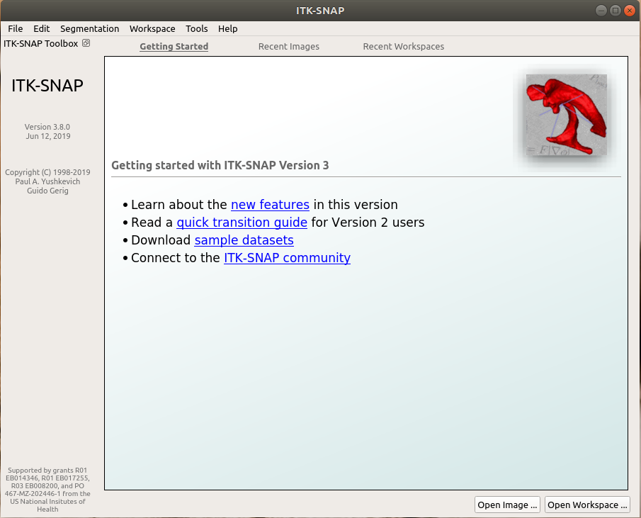
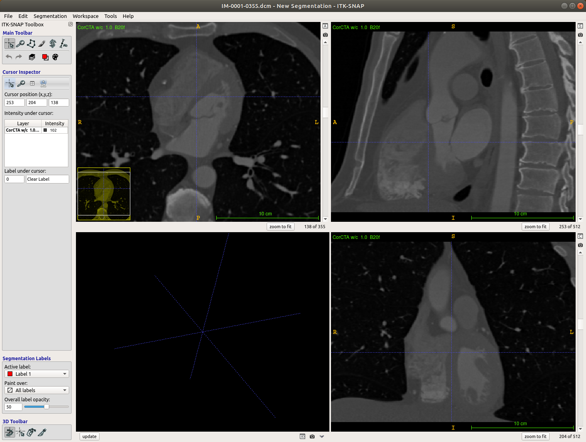
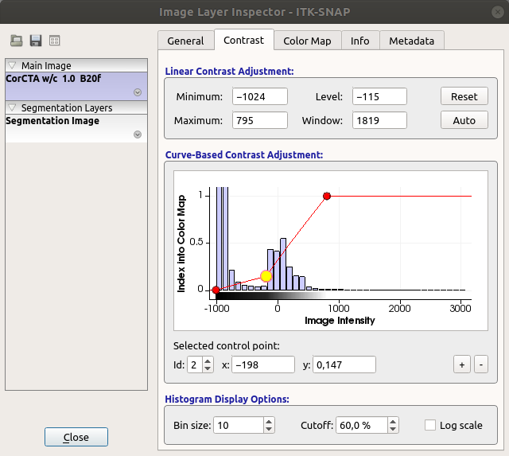
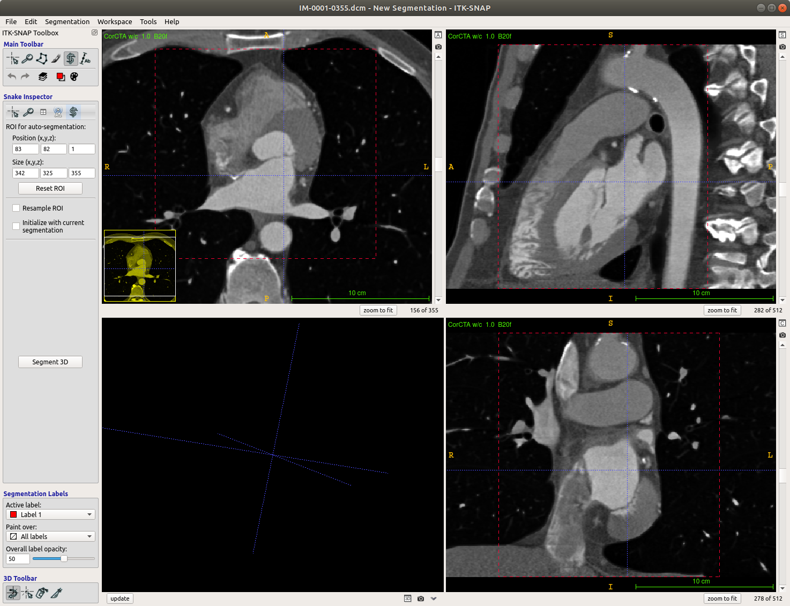
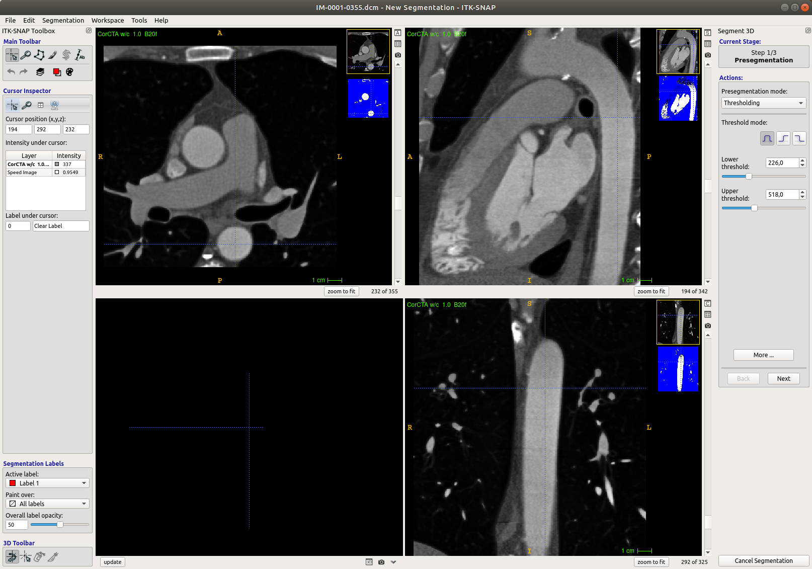

# ITK-SNAP: Semi-automatic image segmentation

#### by Alexandra K. Diem [@akdiem](https://github.com/akdiem)

ITK-SNAP is a fantastic tool for image segmentation that comes with very easy-to-use semi-automatic segmentation functionality. Let’s take a look at the user interface on start-up:

To open a stack of DICOM images click on “Open Image …” in the bottom right corner and select the first .dcm image in your image series and follow the dialogues to load it. In this tutorial I use a series of cardiac CT images from the Osirix Dicom Library (AGECANONIX, https://www.osirix-viewer.com/resources/dicom-image-library/).

After loading the images you are presented with the ITK-SNAP workbench.

The different image views are presented in the three panels at the top left, top right and bottom right, while the bottom left is reserved for the 3D view of your segmentation, so you can ignore it for now. In the panels you can zoom by clicking the right mouse button, move the cross-hair cursor position by clicking the left mouse button and move the image view by clicking the mouse wheel / middle mouse button.

Before beginning with the actual segmentation, we need to adjust the contrast. To auto-adjust hit CTRL-J (CTRL-SHIFT-J to undo). To adjust it manually go to "Tools" &rightarrow; "Image contrast" &rightarrow; "Contrast adjustment ...".

Here you can modify the curve over the histogram to suit your needs. In my case I modified the curve to increase the contrast of blood.

To begin the semi-automatic segmentation either click on the snake button in the Main Toolbar (Active Contour (aka "Snake") Segmentation Mode) or just hit "5" on your keyboard. It can be really difficult to see, but you can now modify the Region Of Interest (ROI) by adjusting the red/yellow dashed borders around your images.

Here I’ve set the ROI to include the heart, the aorta, and a large part of the pulmonary veins coming off the left atrium. Move on by clicking on "Segment 3D".

The first step in the semi-automatic segmentation process is thresholding. Adjust the sliders for the lower and upper threshold such that your area of interest appears as bright white as possible in the blue-and-white preview window.

Ideally, I would have liked to include all blood filled spaces in one go, but the shades of grey are fairly different for the left heart, right heart, and the aorta. So I chose the lower threshold 93.0 and upper threshold 1077.0.