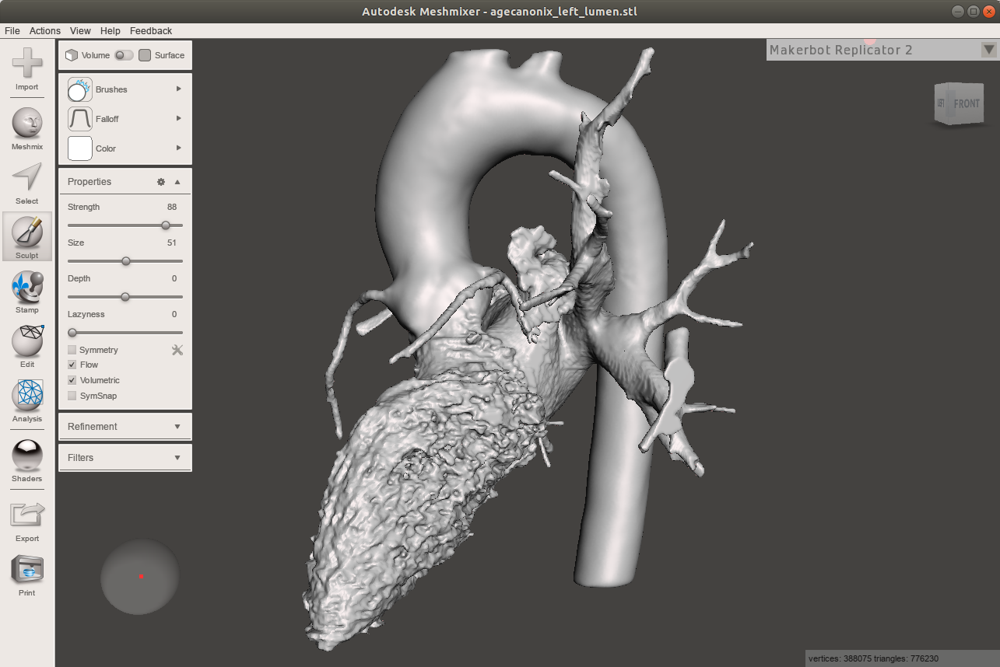

# Autodesk Meshmixer: Clean-up of surface meshes and optimisation

#### by Alexandra K. Diem [@akdiem](https://github.com/akdiem)

Meshmixer is essentially the Photoshop of surface meshing that does a lot of magic. Nominally, it is only available for Windows and MacOS, however, it installs perfectly fine on Linux using the Windows emulator WineHQ. Amongst other things, Meshmixer takes your rugged surface mesh from your segmentation and turns it into a super-smooth usable mesh.

Upon opening Meshmixer we are greeted by the empty workbench.

To import a mesh click "Import" and select your stl file. Here I have chosen the surface mesh of the red label from the [ITK-SNAP guide](itksnap_guide.md).

It is easy to see on the surface mesh that we ideally need to go back to [ITK-SNAP](itksnap_guide.md) to fix the segmentation of the pulmonary vein that is visible in the foreground. For this guide we will ignore this issue.

It is easy to see that the segmentation is very "rough", that is, the surface is quite rugged, which will likely influence a finite element simulation based on this mesh. We need to smoothen it. First, we'll take the aorta. Here, we mostly need to remove the artery stubs on the descending aorta and smooth out the surface. We can do this using the "Robust Smooth" brush of the Sculpt tool. Keeping all parameters as default, we can just "paint" over the aorta. I reduced the size of the sculpt brush around the aortic valve to not smoothen over its shape.

We can do the same with the left atrium since its surface is just a little rugged like the aorta was. Again, I reduced the size of the brush for the pulmonary veins, and also the left atrial appendage.

